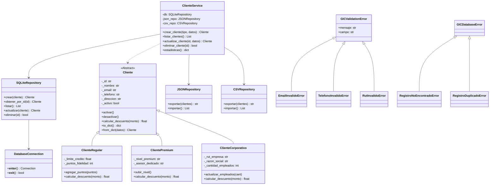

# Diagrama UML de Clases - GIC

```mermaid
classDiagram
    direction TB

    class Cliente {
        <<Abstract>>
        -_id: str
        -_nombre: str
        -_email: str
        -_telefono: str
        -_direccion: str
        -_activo: bool
        +activar()
        +desactivar()
        +calcular_descuento(monto) float
        +to_dict() dict
        +from_dict(datos) Cliente
    }

    class ClienteRegular {
        -_limite_credito: float
        -_puntos_fidelidad: int
        +agregar_puntos(puntos)
        +calcular_descuento(monto) float
    }

    class ClientePremium {
        -_nivel_premium: str
        -_asesor_dedicado: str
        +subir_nivel()
        +calcular_descuento(monto) float
    }

    class ClienteCorporativo {
        -_rut_empresa: str
        -_razon_social: str
        -_cantidad_empleados: int
        +actualizar_empleados(cant)
        +calcular_descuento(monto) float
    }

    class ClienteService {
        -db: SQLiteRepository
        -json_repo: JSONRepository
        -csv_repo: CSVRepository
        +crear_cliente(tipo, datos) Cliente
        +listar_clientes() List
        +actualizar_cliente(id, datos) Cliente
        +eliminar_cliente(id) bool
        +estadisticas() dict
    }

    class SQLiteRepository {
        +crear(cliente) Cliente
        +obtener_por_id(id) Cliente
        +listar() List
        +actualizar(cliente) Cliente
        +eliminar(id) bool
    }

    class JSONRepository {
        +exportar(clientes) str
        +importar() List
    }

    class CSVRepository {
        +exportar(clientes) str
        +importar() List
    }

    class DatabaseConnection {
        +__enter__() Connection
        +__exit__() bool
    }

    class GICValidationError {
        +mensaje: str
        +campo: str
    }
    class EmailInvalidoError
    class TelefonoInvalidoError
    class RutInvalidoError

    class GICDatabaseError
    class RegistroNoEncontradoError
    class RegistroDuplicadoError

    Cliente <|-- ClienteRegular
    Cliente <|-- ClientePremium
    Cliente <|-- ClienteCorporativo

    ClienteService --> SQLiteRepository
    ClienteService --> JSONRepository
    ClienteService --> CSVRepository
    ClienteService ..> Cliente

    SQLiteRepository --> DatabaseConnection

    GICValidationError <|-- EmailInvalidoError
    GICValidationError <|-- TelefonoInvalidoError
    GICValidationError <|-- RutInvalidoError
    GICDatabaseError <|-- RegistroNoEncontradoError
    GICDatabaseError <|-- RegistroDuplicadoError
```
